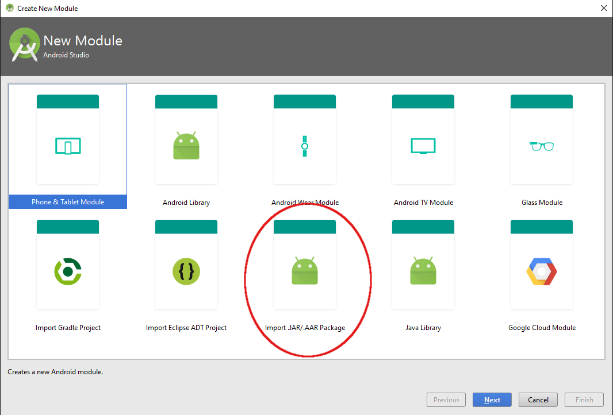
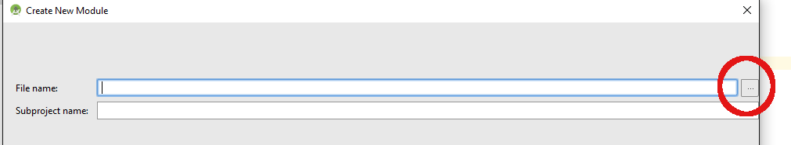
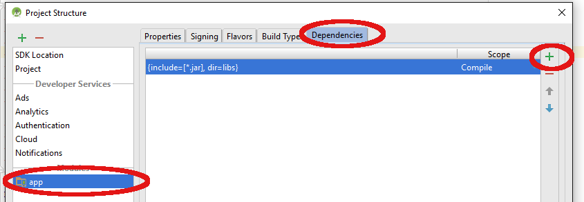
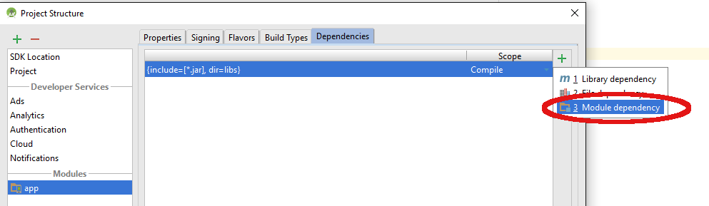
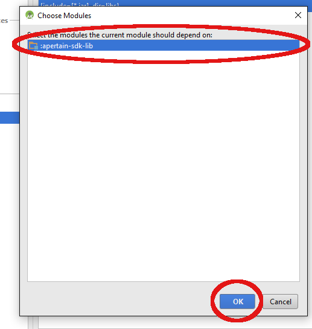

A(P)ertain SDK AAR Integration Instructions with Android Studio App Project
===========================================================================

This document describes step by step instructions to integrate A(P)ertain SDK AAR with Android Studio App Project.

Before you Begin
----------------

Before implementing the SDK, make sure you have the following:

* Download the A(P)ertain SDK AAR from [here](https://github.com/jkltech/apertain-as-aar).
* We would recommend if you clone this github project for future updates.

### Step 1:

Open your Android Studio App Project.

### Step 2:

Right click on your project and choose "Open Module Settings".

### Step 3:

Click the "+" button in the top left to add a new module.

### Step 4:

Choose "Import .JAR or .AAR Package" and click the "Next" button.

### Step 5:

Find the AAR file - "apertain-sdk-lib.aar" from your git clone of the 'apertain-as-aar' SDK Project, using the ellipsis button ("...") beside the "File name" field.

### Step 6:

Keep the app's module selected and click on the Dependencies pane to add the new module (apertain-sdk-lib) as a dependency.

### Step 7:

Use the "+" button of the dependencies screen and choose "Module dependency".

### Step 8:

Choose the module 'apertain-sdk-lib' and click "OK".

Now you have added APertain SDK AAR as a Module inside your App. Please don't forget to sync again from the github whenever there is a new build version available for APertain SDK in the [github project](https://github.com/jkltech/apertain-as-aar).
