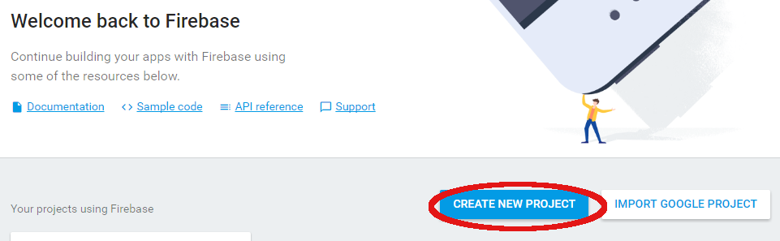
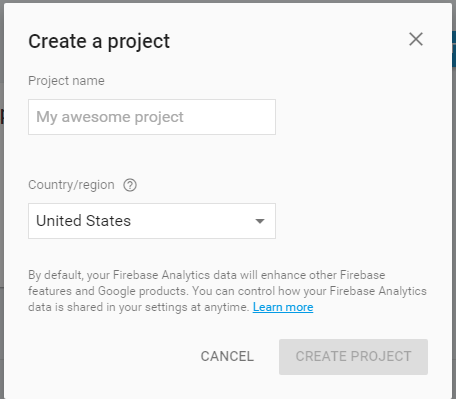
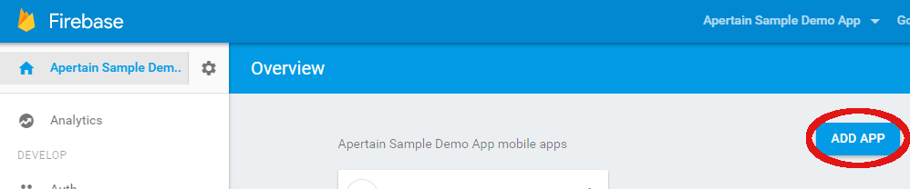
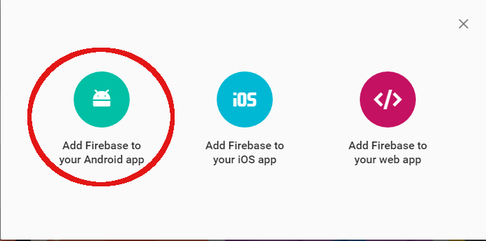
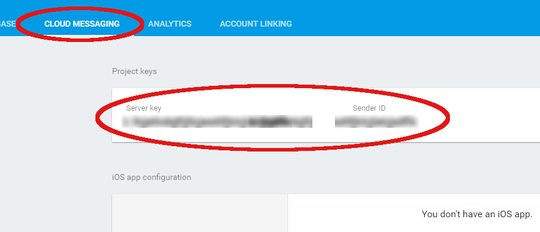
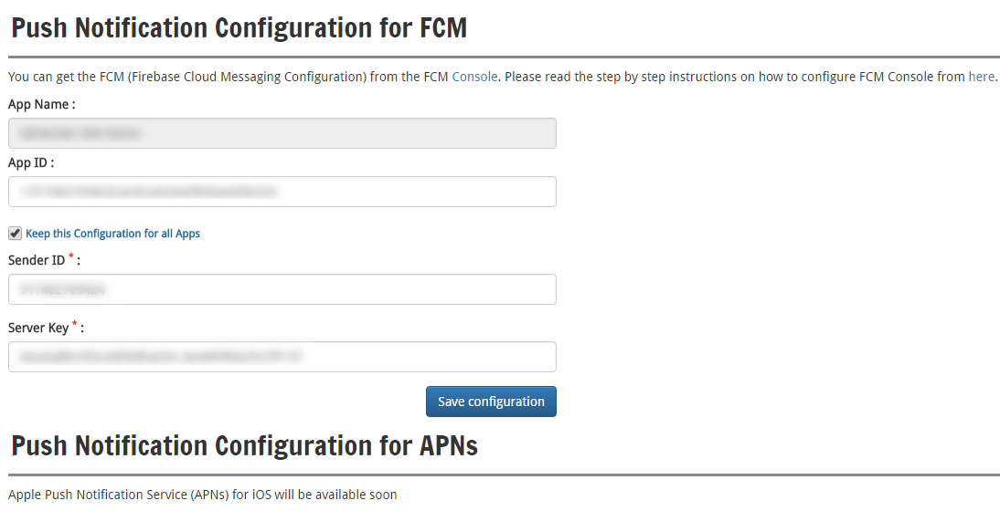

A(P)ertain SDK AAR Integration Instructions with Android Studio App Project
===========================================================================

This document describes step by step instructions to integrate A(P)ertain SDK AAR with Android Studio App Project.

Before you Begin
----------------

* Login to the [APertain Console](https://www.apertain.com/login.apt) and navigate to "Interactions --> Push Notifications --> Push Configuration". Follow the below Steps.

### Step: 1:

Here you create your own Project for your Organization or the Client and add Apps relevant to your organization by using Add New Project.

### Step: 2:

Create an awesome new Project.

### Step: 3: 

Add App

### Step: 4: 

Select Add Firebase to your Android App.

### Step: 5: 

Download Google Services JSON (google-services.json) file for your App and also note down App ID of your App.

### Step: 6: 

Go to Cloud Messaging and Note Down Android Projects Server Key & Sender ID.

### Step: 7: 

Configure APertain Console with the noted down data such as App ID, relevant to your App and Server Key & Sender ID which are relevant to all your Firebase Android Apps.

### Step 8: Adding Firebase SDK in App

First, add rules to your root-level build.gradle file, to include the google-services plugin:

	buildscript {
		// ...
		dependencies {
			// ...
			classpath 'com.google.gms:google-services:3.0.0'
		}
	}

Then, in your module Gradle file (usually the app/build.gradle), add the apply plugin line at the bottom of the file to enable the Gradle plugin:

	apply plugin: 'com.android.application'

	android {
	  // ...
	}

	dependencies {
	  // ...
	  compile 'com.google.firebase:firebase-core:9.4.0'
	}

	// ADD THIS AT THE BOTTOM
	apply plugin: 'com.google.gms.google-services'

## NOTE: 

Instructions to integrate FCM with iOS or APNS with iOS will follow in another document as iOS SDK is made available. APertain iOS SDK is under development & will be made available soon.